# Hybrid Recommendation System with Contextual Enrichment

[](https://www.python.org/downloads/)
[](https://github.com/benfred/implicit)

Advanced hybrid recommendation system combining collaborative filtering and content-based approaches with temporal awareness and contextual personalization.

## Key Features

- **Hybrid Architecture**: Combines matrix factorization (ALS) and semantic content-based filtering
- **Temporal Weighting**: Exponential decay of tag relevance (λ=0.002)
- **BM25 Transformation**: Non-linear weighting of implicit feedback
- **Dynamic Blending**: Context-aware balance between CF and CB components
- **Online Learning**: Partial updates for real-time adaptation
- **Stemmed N-gram Features**: Enhanced text processing with Snowball stemmer

## Mathematical Foundations

### 1. Collaborative Filtering (ALS with BM25)
```math
\text{BM25}(w) = \frac{(K1 + 1)w}{K1(1 - B + B\frac{L}{L_{avg}}) + w} \quad (K1=100, B=0.8)
```
```math
\min_{X,Y} \sum_{u,i} (c_{ui} - x_u^Ty_i)^2 + λ(||X||^2_F + ||Y||^2_F) \quad (λ=0.08, factors=128)
```

### 2. Content-Based Filtering
```math
\text{TF-IDF}(t,d) = \text{tf}(t,d) × \log\frac{N}{\text{df}(t)}
```
```math
\text{sim}(a,b) = \cos(θ_{a,b}) = \frac{\mathbf{v}_a · \mathbf{v}_b}{||\mathbf{v}_a||·||\mathbf{v}_b||}
```

### 3. Hybrid Scoring
```math
\alpha = \text{clip}(0.8 - 0.6\frac{\log(1+\text{tag\_count})}{\log(100)}, 0.2, 0.8)
```
```math
\text{Score} = \alpha·\text{CF} + (1-\alpha)(0.7·\text{CB} + 0.3·\text{FavSim})
```




```mermaid
graph TD
    subgraph DataLayer[Data Preparation]
        A[User-Artist Interactions] --> B[BM25 Weighting]
        C[Artist Tags] --> D[Temporal Weighting]
        E[Timestamps] --> D
    end

    subgraph CF[Collaborative Filtering]
        B --> F[ALS Optimization]
        F --> G[Factor Matrices]
        G --> H[CF Score]
    end

    subgraph CB[Content-Based Filtering]
        D --> I[Stemmed N-grams]
        I --> J[TF-IDF Vectors]
        J --> K[Cosine Similarity]
        K --> L[CB Score]
    end

    subgraph Hybrid[Hybrid Engine]
        H --> M{Dynamic Blending}
        L --> M
        D --> N[α Calculation]
        N --> M
        M --> O[Final Score]
    end

    subgraph Runtime[Online Adaptation]
        O --> P[Recommendations]
        P --> Q[Partial Updates]
        Q --> F
        Q --> J
    end

    subgraph Optim[Optimizations]
        R[Sparse Matrices] --> F & J
        S[Cached Indices] --> K & M
        T[Memory Management] --> Q
    end

    style DataLayer fill:#444,stroke:#888
    style CF fill:#333,stroke:#777
    style CB fill:#333,stroke:#777
    style Hybrid fill:#222,stroke:#666
    style Runtime fill:#333,stroke:#777
    style Optim fill:#444,stroke:#888
    style M fill:#000,stroke:#fff
    style O fill:#fff,stroke:#000,color:#000

```

## Installation

```bash
python3.12 -m venv .venv
source .venv/bin/activate
pip install -r requirements.txt
```

**Requirements:**
- implicit==0.7.2 (requires C compiler)
- scipy>=1.10.1
- scikit-learn>=1.2.2
- pandas>=2.0.3
- numpy>=1.24.3
- nltk>=3.8.1

## Data Preparation

Place Last.fm dataset files in `/lastfmdata`:
- `user_artists.dat`
- `artists.dat`
- `tags.dat`
- `user_taggedartists.dat`
- `user_taggedartists-timestamps.dat`

## Usage

```python
# Initialize recommender
from hybrid_recommender import HybridRecommender
recommender = HybridRecommender(data_path="lastfmdata/")

# Get recommendations
recommendations = recommender.recommend(user_id=2, top_n=10)
"""
[('The Beatles', 0.872),
 ('Radiohead', 0.855),
 ('Pink Floyd', 0.841), ...]
"""

# Update model with new interactions
new_data = pd.DataFrame({
    'userID': [2, 2],
    'artistID': [123, 456],
    'weight': [5000, 3000]
})
recommender.partial_fit(new_data)
```

## Implementation Details

### Core Components
1. **Collaborative Filtering**
   - BM25-weighted implicit feedback
   - Alternating Least Squares optimization
   - CSR matrix format for efficient operations

2. **Content-Based Filtering**
   - Temporal-weighted tag aggregation
   - Stemmed bigram TF-IDF vectors
   - Cosine similarity index

3. **Hybrid Engine**
   - Dynamic weighting (α) based on user activity
   - Contextual blending of three signals:
     - ALS predicted scores
     - Personal tag relevance
     - Favorite artist similarity

### Key Optimizations
- Sparse matrix operations (CSR format)
- Cached similarity indices
- Batched partial updates
- Memory-efficient resizing

## References

1. Hu, Y., Koren, Y., & Volinsky, C. (2008). [Collaborative Filtering for Implicit Feedback Datasets](https://ieeexplore.ieee.org/document/4781121)
2. Robertson, S., & Zaragoza, H. (2009). [The Probabilistic Relevance Framework: BM25 and Beyond](https://dl.acm.org/doi/10.1561/1500000019)
3. Cremonesi, P., et al. (2010). [Performance of Recommender Algorithms on Top-N Recommendation Tasks](https://dl.acm.org/doi/10.1145/1864708.1864721)

## License
MIT License (see LICENSE file)
